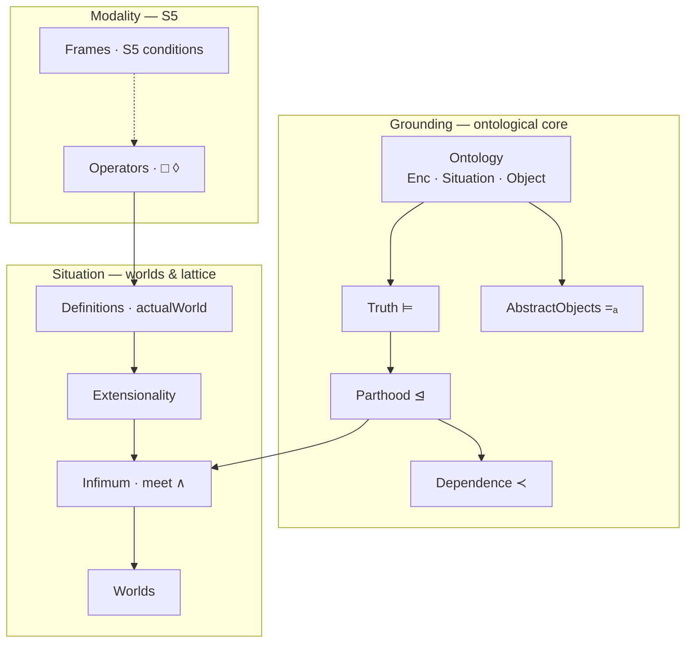
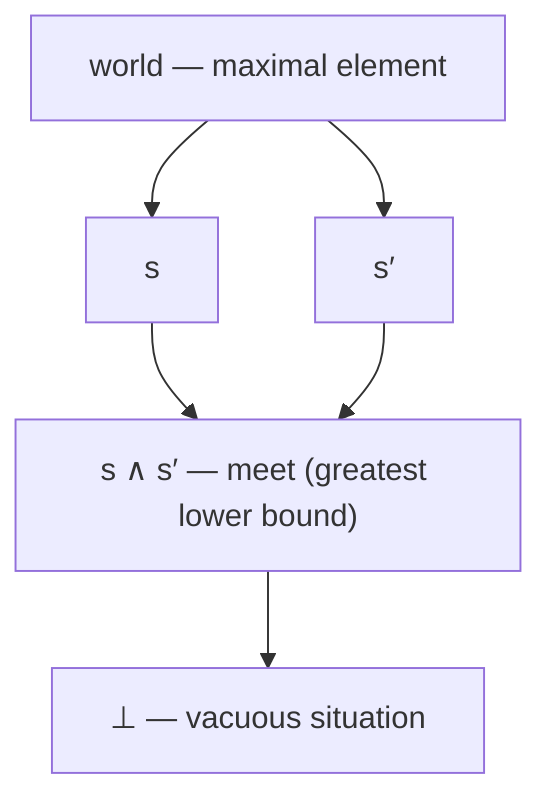

# Possible-World-Semantics

> A machine-checked theory of possible worlds, situations, and modal necessity — formalizing *what could have been*, and proving it, in Lean 4.

[](https://hanielulises.github.io/Possible-World-Semantics/)
[](https://leanprover.github.io/)
[](#open-proof-obligations)
[](LICENSE)

A Lean 4 formalization of possible-world and situation semantics, following the higher-order modal and situation-theoretic tradition of Zalta, Fine, and Barwise–Perry. Every theorem below is checked by the Lean kernel; every remaining `sorry` is tabulated as an explicit, open proof obligation.

## Architecture

The development is layered: an ontological **Grounding** core fixes the primitives and their algebra, a **Modality** layer postulates the S5 calculus, and a **Situation** layer builds worlds and their meet-semilattice on top.



## Getting Started

The toolchain is pinned in `lean-toolchain` (Lean `v4.26.0`), so the build is reproducible — [`elan`](https://github.com/leanprover/elan) selects the right compiler automatically.


## Theoretical Background

The development follows the Zalta–Fine tradition. Worlds and situations are not distinguished at the type level: `World` is the single domain, and `Situation` and `Object` are predicates over it.

The central primitive is encoding (`Enc`). A situation encodes the properties that constitute its informational content. Parthood is defined encoding-first: `s ⊴ s'` holds iff every property encoded by `s` is also encoded by `s'`, matching the mereology of Barwise–Perry and the abstract object theory of Zalta.

Modal operators are axiomatic, and not reduced to Kripke frames. The S5 schemas are postulated directly:

```
□(φ → ψ) → □φ → □ψ          (K)
□φ → φ                      (T)
□φ → □□φ                    (4)
◊φ → □◊φ                    (5)
```

`Modality/Frames.lean` provides the frame-level conditions as a potential semantic grounding, but they are not wired to `Box` by default. The modal layer stays neutral with respect to frame semantics.

Extensionality is a postulate. Situations are individuated by propositional content:

```
Situation(s) ∧ Situation(s') ∧ (∀p, s ⊨ p ↔ s' ⊨ p) → s = s'
```

This cannot be derived from purely intensional primitives and must be stipulated, which is the standard move in both situation semantics and abstract object theory.

### The situation lattice

Under parthood `⊴`, situations form a meet-semilattice: `⟨Sit, ⊴, ∧⟩`. Worlds are the maximal elements (maximal consistent content); the meet `s ∧ s'` is the greatest lower bound, whose content is exactly what `s` and `s'` share.



*A fragment of the meet-semilattice: edges denote parthood, descending from maximal worlds to the vacuous situation. The structure is a meet-semilattice with distinguished maximal elements, not a complete lattice — see [OP-4](#open-proof-obligations).*

## Axiom Inventory

| Axiom | File | Status |
|---|---|---|
| `World`, `Property`, `Propn` | `Grounding/Ontology` | primitive type |
| `Object`, `Situation` | `Grounding/Ontology` | primitive predicate |
| `Enc`, `Encp`, `VAC` | `Grounding/Ontology` | primitive relation / operator |
| `situation_is_object` | `Grounding/Ontology` | predicate inclusion postulate |
| `neg` (¬ₚ) | `Grounding/Propositions` | primitive connective |
| `TrueIn` (⊨) | `Grounding/Truth` | primitive relation |
| `Encp_def` | `Grounding/Truth` | Prover9-verified metatheorem |
| `TrueIn_def` | `Grounding/Truth` | Prover9-verified metatheorem |
| `R`, `R_refl`, `R_trans`, `R_symm` | `Modality/Frames` | S5 frame conditions |
| `Box` (□) | `Modality/Operators` | primitive modal operator |
| `K`, `T`, `Four`, `Five` | `Modality/Operators` | S5 axioms |
| `Nec` | `Modality/Operators` | necessitation rule |
| `PossNec` | `Modality/Operators` | ◊□φ → □φ, S5 collapse |
| `actualWorld` | `Situation/Definitions` | designated constant |
| `situation_extensionality` | `Situation/Extensionality` | constitutive postulate |
| `Concrete`, `ordinary_no_encoding`, `Comprehension` | `Grounding/AbstractObjects` | primitive / comprehension postulate |
| `abstract_extensionality` | `Grounding/AbstractObjects` | constitutive postulate |
| `situation_extensionality_via_truth` | `Situation/Theorems` | Prover9 Theorem 2 |
| `actual_implies_possible` | `Situation/Theorems` | modal postulate |
| `situation_closed_under_parthood` | `Situation/Theorems` | Prover9 Theorem 3 |
| `meet`, `meet_situation`, `TrueIn_meet` | `Situation/Infimum` | meet existence and truth conditions |

## Open Proof Obligations

Every `sorry` in the codebase corresponds to exactly one entry in this table.

| ID | Obligation | Blocks | File |
|---|---|---|---|
| OP-2b | `parthood_implies_depends` | derivation that `s ⊴ s' → s ≺ s'` | `Grounding/Dependence.lean` |
| OP-4 | `meet_le_left`, `meet_le_right`, `meet_greatest` | full lattice structure of meet | `Situation/Infimum.lean` |
| OP-5 | `no_strict_subworld` | strict subworld exclusion | `Situation/Worlds.lean` |

### OP-2b — Parthood implies dependence

`parthood_implies_depends` states that if `s ⊴ s'` and `s'` depends on `s''`, then `s` depends on `s''`. The proof requires converting `s ⊴ s'` into `s ≺ s'` (ontological dependence). `truth_mono_to_part` (resolved as OP-2) is now available, but the conversion is not immediate: `OntologicallyDepends s s'` is `∀ u, Situation u → s ⊴ u → s' ⊴ u`, which is a claim about all containing situations, not just a truth-transfer statement. Whether this follows from `s ⊴ s'` alone or requires an additional postulate remains to be determined.

### OP-4 — Lattice structure of meet

`meet_le_left`, `meet_le_right`, and `meet_greatest` all need to connect `TrueIn_meet` (which governs truth at the meet) to `PartOf` (which is defined over `Enc`). `truth_mono_to_part` is now available (OP-2 resolved), so all three should be closeable by applying it to the truth conditions given by `TrueIn_meet`. No new axioms are expected to be needed.

### OP-5 — No strict subworld

`no_strict_subworld` states that no proper part of a world is itself a world. The two `sorry` markers correspond to steps that propagate truth across the parthood relation. Both are now unblocked by the resolution of OP-2 and should be closeable using `part_truth_mono` and `truth_mono_to_part`.

## Resolved Proof Obligations

### OP-2 — Parthood via truth-monotonicity

`PartOf` is defined over `Enc` while `TrueIn` is an independent primitive. The direction

```
(∀p, s ⊨ p → s' ⊨ p) → s ⊴ s'
```

was not initially derivable, leaving the biconditional `s ⊴ s' ↔ ∀p, s ⊨ p → s' ⊨ p` half-proved and blocking antisymmetry (Theorem 5) and same-parts identity (Theorem 6) of Zalta (1993).

Closed by `truth_mono_to_part` in `Grounding/Parthood.lean`. The proof goes via `Enc_VAC_complete`, where every property encoded by a situation is of the form `VAC p`, so truth-monotonicity in the `TrueIn` sense transfers back to encoding-monotonicity in the `Enc` sense, yielding `s ⊴ s'` directly. No new axioms were needed beyond `Enc_VAC_complete` and `situation_is_object` (OP-3). With this in place, `parthood_iff_truth_inclusion`, `parthood_antisymm`, `same_parts_identity`, and `all_propositions_persistent` all close without `sorry`. Metatheoretic justification: the Prover9 proof `theorem4.in` at peoppenheimer.org/cm/worlds/, Theorem 4 of Zalta (1993).

### OP-1 — Necessitation and possible-necessity collapse

The necessitation rule `(∀w, φw) → ∀w, □φw` and the S5 collapse `◊□φ → □φ` are not derivable from K, T, 4, and 5 alone. Necessitation is admissible in every normal modal logic but is not a substitution instance of any of the schemas. The collapse holds in all S5 frames by euclideanity but requires a frame-level reduction or a direct postulate in a purely axiomatic development.

Both were closed by postulating `Nec` and `PossNec` in `Modality/Operators.lean`. Deriving them from `Modality/Frames.lean` remains possible but is not imposed.

### OP-3 — Situations are objects

`TrueIn_def` and `Encp_def` both require an `Object x` hypothesis. `Situation` and `Object` are independent predicates with nothing forcing their extensions to overlap. The bridge `Situation(s) → Object(s)` was postulated as `situation_is_object` in `Grounding/Ontology.lean`.

With this in place, `part_truth_mono` closes without `sorry`: the direction `s ⊴ s' → (s ⊨ p → s' ⊨ p)` is fully derived by unfolding `TrueIn_def` and `Encp_def` on both sides and applying encoding-monotonicity of `PartOf` directly.

## Derived Theory

Beyond the core obligations, the development carries several families of
purely derived results (no new postulates beyond those tabulated above):

- **Modal calculus** (`Modality/Operators`). On top of the S5 core, `□`/`◊`
  duality (`Box_iff_not_Diamond_not`), the monotonicity of `◊`
  (`Diamond_monotone`), distribution laws (`Diamond_distrib_disj`,
  `Box_distrib_conj`), and the contingency vocabulary (`Necessary`,
  `Impossible`, `Contingent`) with their exclusion theorems. Each is a
  calculation over the universal accessibility relation `R`.

- **Propositional algebra** (`Grounding/Propositions`). Contraposition
  (`impl_contrapositive`) alongside the De Morgan and double-negation laws.

- **Abstract-object identity** (`Grounding/AbstractObjects`). Zalta's
  encoding-identity `=ₐ` (`IdentityA`) as an equivalence relation, its
  collapse to `=` under `abstract_extensionality`, and the promotion of
  `Comprehension` to a definite description (`abstract_object_unique`).

- **Grounding structure** (`Grounding/Dependence`). Strict dependence,
  grounding as asymmetric dependence (`WeaklyGrounds`, `weakly_grounds_asymm`),
  and the exhaustiveness of the foundational/derivative dichotomy
  (`not_foundational_iff_derivative`).

## Contributing

Contributions are welcome especially proofs. The three open obligations are self-contained and each comes with a documented strategy, so they make good entry points:

| Obligation | Where | Why it's tractable |
|---|---|---|
| [OP-4](#op-4--lattice-structure-of-meet) | `Situation/Infimum.lean` | `truth_mono_to_part` is already available; all three lemmas should close by applying it to `TrueIn_meet`. **Best first proof.** |
| [OP-5](#op-5--no-strict-subworld) | `Situation/Worlds.lean` | Two `sorry`s, both unblocked by OP-2; closeable with `part_truth_mono` and `truth_mono_to_part`. |
| [OP-2b](#op-2b--parthood-implies-dependence) | `Grounding/Dependence.lean` | Open-ended: may follow from `s ⊴ s'` alone or need a new postulate — the more research-flavored one. |

**Ground rules.**

- No new axioms without discussion. If a proof genuinely needs a postulate, open an issue first — the whole point of the [Axiom Inventory](#axiom-inventory) is that it stays complete and honest.
- Every `sorry` must correspond to exactly one row in [Open Proof Obligations](#open-proof-obligations); if you close one, delete its row and (if it unblocks others) update the dependent entries.
- `lake build` must pass with no errors and no new `sorry`.

To get started: pick an obligation above, open an issue to claim it, then send a PR. Questions and partial attempts are just as welcome as finished proofs.

## References

Zalta, E. *Intensional Logic and the Metaphysics of Intentionality*. MIT Press, 1988.

Fine, K. "Ontological Dependence." *Proceedings of the Aristotelian Society*, 1995.

Barwise, J. and Perry, J. *Situations and Attitudes*. MIT Press, 1983.

Oppenheimer, P. and Zalta, E. "The Computational Theory of Possible Worlds." peoppenheimer.org/cm/worlds/
